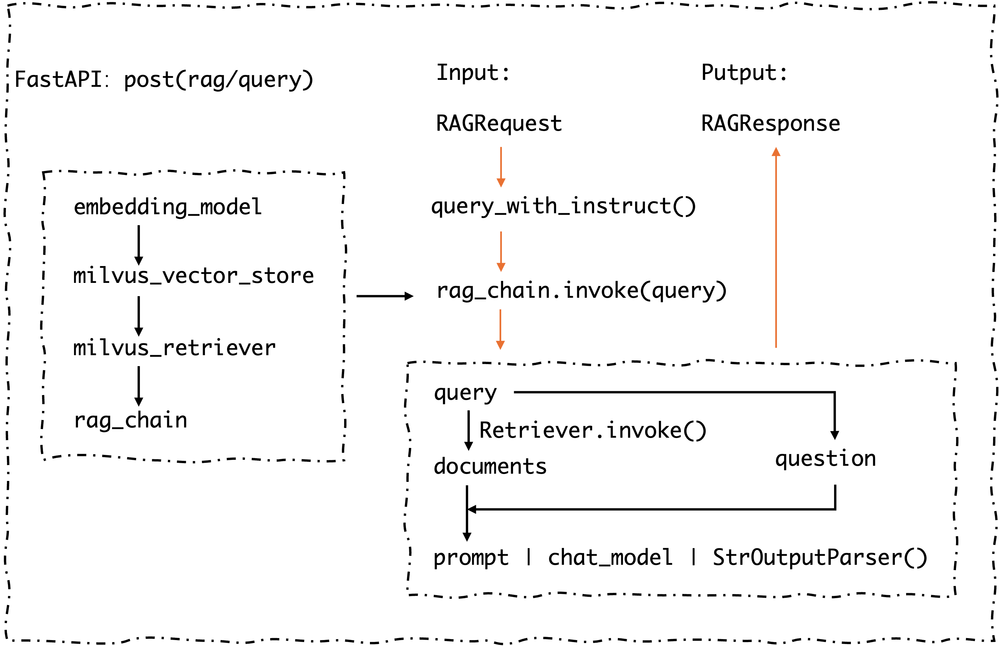

# 版本 V1.0

## 介绍
基于LangChain应用开发框架，使用vLLM部署Qwen3-Embedding-0.6B和DeepSeek-R1-Distill-Qwen-1.5B，分别进行Embedding和Reasoning。使用Milvus进行向量存储。使用FastAPI构建Restful API提供接口服务。

## 🚀 项目演示
[](./pic/MRAGV1.0演示.mp4)

## ✨核心亮点
* 🔐数据私有化与离线支持：无需联网，所有文档处理和模型推理均在本地完成。一键上传PDF文档，系统自动进行向量化和索引
* ⚡高性能模型服务：基于vLLM本地部署大模型DeepSeekR1-1.5B
* 🔗推理溯源：推理依据溯源原始文档页面
* 🌐联网检索：集成 SerpAPI，在本地知识库无法回答时，可智能调用搜索引擎获取实时信息，兼具深度与广度
* 🎨可视化界面：基于 Gradio 构建的交互式Web界面，让非技术人员也能轻松上手，进行文档管理和智能问答
* 🧩模块化架构：基于LangChain、FastAPI和Milvus等业界主流框架构建，代码结构清晰，逻辑解耦

## 使用步骤

1. 下载Qwen3-Embedding-0.6B和DeepSeek-R1-Distill-Qwen-1.5B模型
2. 运行脚本启动DeepSeek-R1服务
    ```bash
    bash ./scripts/start.sh
    ```
3. 离线构建本地知识库
    ```bash
    python ./server/kn_builder.py
    ```
4. 在线启动问答服务
    ```bash
    python ./server/chat.py
    ```

## 代码逻辑图



## 🗺️ 未来蓝图

V1.0 仅仅是我们的起点。我们已经规划了清晰的迭代路径，让MRAG变得更加强大：
* **[V2.0] 迈向多模态:** 引入OCR技术，支持对扫描版PDF和图片内容的理解和问答。
* **[V3.0] 原生多模态:** 基于ColPali实现真正的图文混合检索与问答。
* **[V4.0] 进化为智能代理 (Agent):** 引入 Agent 概念，实现能够自主规划、执行复杂任务的 DeepSearch 深度搜索智能体


