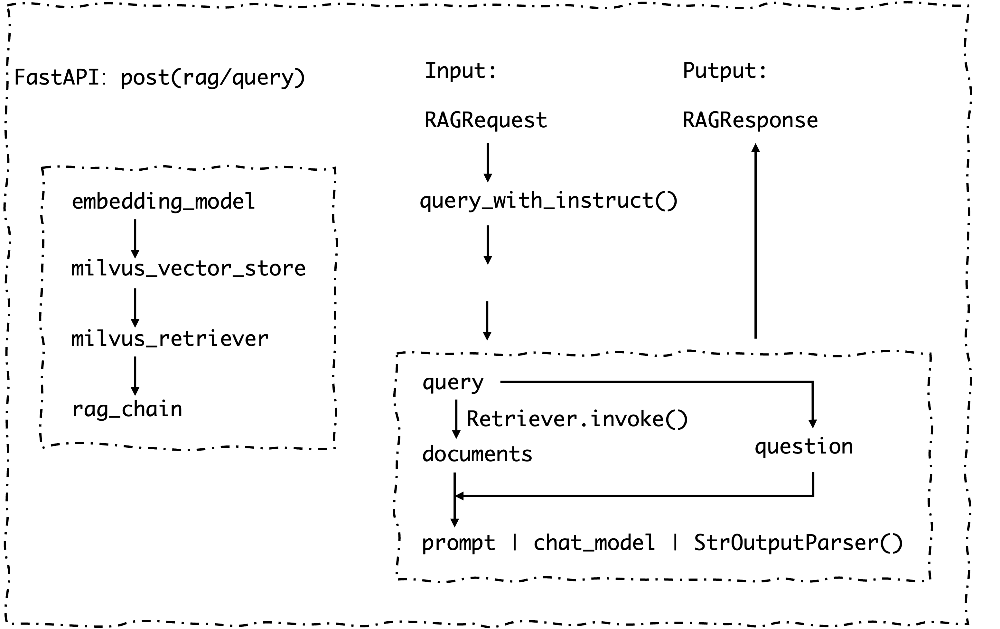
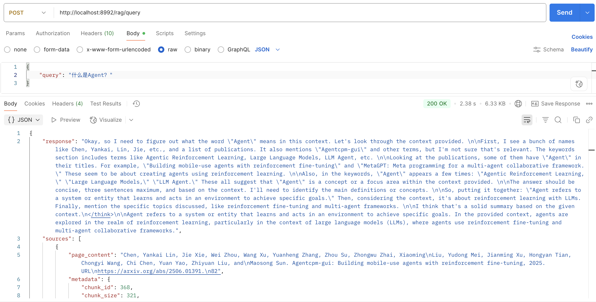

## 版本 V1.0.0

## 介绍
基于LangChain应用开发框架，使用Qwen3-Embedding-0.6B进行文档Embedding和DeepSeek-R1-Distill-Qwen-1.5B进行推理。。使用Milvus进行向量存储。使用FastAPI构建Restful API提供接口服务。

## 功能
1. 离线构建本地知识库
2. 在线启动问答服务
3. 推理依据可溯源

## 使用步骤

1. 下载Qwen3-Embedding-0.6B和DeepSeek-R1-Distill-Qwen-1.5B模型
2. 运行脚本启动DeepSeek-R1服务
    ```bash
    bash ./scripts/start.sh
    ```
3. 离线构建本地知识库
    ```bash
    python ./server/kn_builder.py
    ```
4. 在线启动问答服务
    ```bash
    python ./server/chat.py
    ```

## 代码逻辑图


## 效果图
